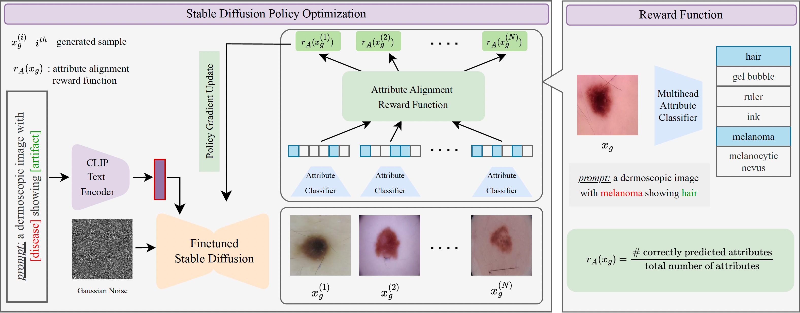

# **RL4Med-DDPO: Official PyTorch Implementation**  

- **Venue**: MICCAI 2025
- **Paper**: RL4Med-DDPO: Reinforcement Learning for Controlled Guidance Towards Diverse Medical Image Generation using Vision-Language Foundation Models 
- **Authors**: Parham Saremi\*, Amar Kumar\*, Mohamed Mohamed, Zahra TehraniNasab, Tal Arbel
- **Institution(s)**:  Mila - Quebec AI Institute, McGill University

<p align="center">
<a href="https://arxiv.org/pdf/2503.15784" alt="arXiv">
    </a>
<a href="https://parhamsaremi.github.io/rl4med-ddpo/" alt="webpage">
    </a>


  
</p>



## Setup  
This codebase builds upon the [ddpo-pytorch repository](https://github.com/kvablack/ddpo-pytorch?tab=readme-ov-file) and requires Python 3.10 or newer.

To install the required packages, run:
```bash
cd rl4med-ddpo
pip install -e .
```

*Note:* You can use `export WANDB_MODE=offline` to avoid logging in to WANDB. 

---

### Trained Weights and Samples

Trained models and generated samples can be found in our [Google Drive](https://drive.google.com/drive/folders/1ah15Yu5Iu7kXdSM649yKhqCLDhqol0ef). The folder contains the following files:

- **pretrained_unet.safetensors**: The weights of the UNet trained on the ISIC 2019 dataset.  
- **rl4med-checkpoint50/**: A folder containing the RL4Med-trained weights after 50 epochs.  
- **artifact_classifier_train_H6.pth**: The weights of the artifact classifier with `H=6` used for fine-tuning the model.  
- **artifact_classifier_train_H4.pth**: The weights of the artifact classifier with `H=4` used for calculating the metrics.  
- **images.zip**: The generated images from the pretrained Stable Diffusion (SD) model and the fine-tuned RL+SD model.

You can use the following command after installing the packages.  

```bash
gdown --folder -O rl4med-out/published 1ah15Yu5Iu7kXdSM649yKhqCLDhqol0ef 
unzip rl4med-out/published/images.zip -d rl4med-out/published/
```

---

### Paths and Models

First, create an output/logging folder (e.g., `rl4med-out`) for saving checkpoints or downloading models. This folder will be referenced in the config file. *(If you used the download command from the previous section, this folder should already exist.)*

You can modify the paths to the dataset, logging directory, and published models in the `model_and_dataset_configs` function located in `config/dgx.py`.

---

### Data Preparation

**Note:** This step is only required for calculating metrics and training the classifier. Fine-tuning the UNet using a reward function does not require the dataset, as the model is fine-tuned on its own outputs.

The ISIC 2019 dataset is used in this project and can be downloaded [here](https://challenge.isic-archive.com/data/#2019).

After downloading the data, use the following command to preprocess and separate the dataset into prompts:
```bash
accelerate launch scripts/extract_dataset_latents.py --config config/dgx.py:preprocess_isic_real_data
```

---

## Training the Classifier

The code for training the multi-head classifier is provided and can be launched using the following command:
```bash
accelerate launch --num_processes 1 scripts/train_isic_classifier.py --data_path <Path to ISIC Dataset>
```

**Note:** Retraining the classifier is optional. The provided weights are sufficient for training and evaluating the RL4Med pipeline.

---

## Training

To train the model using the classifier-based reward:
```bash
accelerate launch scripts/train.py --config config/dgx.py:prompt_image_alignment_classifier_isic
```

---

## Generating Images

To generate images using the RL-fine-tuned model:
```bash
accelerate launch scripts/eval.py --config config/dgx.py:prompt_image_alignment_classifier_isic_eval_rl
```

To generate images using the original Stable Diffusion model:
```bash
accelerate launch scripts/eval.py --config config/dgx.py:prompt_image_alignment_classifier_isic_eval
```

---

## Calculating Metrics

To evaluate metrics for the RL-fine-tuned model:
```bash
accelerate launch --num_processes 1 scripts/metric.py --config config/dgx.py:evaluate_metric_rl
```

To evaluate metrics for the base Stable Diffusion model:
```bash
accelerate launch --num_processes 1 scripts/metric.py --config config/dgx.py:evaluate_metric_sd
```

---

## Important Hyperparameters

A detailed explanation of all hyperparameters can be found in `config/base.py`. Below are a few important ones:

- `prompt_fn`: Name of the prompt function, located in `ddpo_pytorch.prompts`.
- `reward_fn`: Name of the reward function, located in `ddpo_pytorch.rewards`.
- `sample.batches` and `sample.num_batches_per_epoch`: Determine how many samples are generated to fine-tune the model per epoch. This corresponds to **M** in the paper. The model is trained with 256 samples per epoch using 4 A100 GPUs.
- `train.batches` and `train.gradient_accumulation_steps`: Control how many gradient updates are performed per epoch. This corresponds to **K** in the paper. The model is trained with 2 gradient steps per epoch.